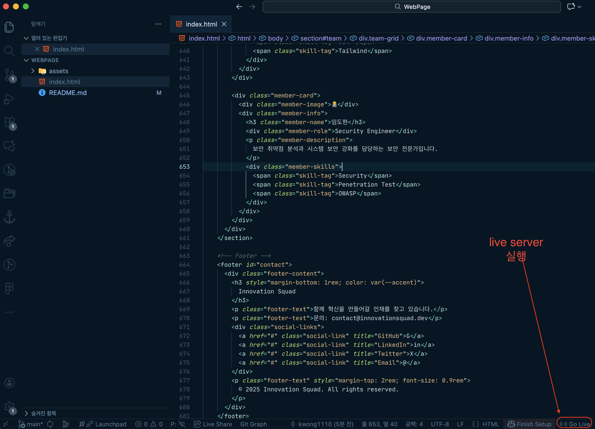

# WebPage

LG CNS AM Inspire Camp 4기 아이스브레이킹 4조 웹 페이지입니다.

## 진행 상황

- 12.17 (수)
  화요일에 나누었던 내용과 다른 의견 있는지 논의해보시면 좋겠네요.
  (제안) repository 만든김에 저희끼리 git 간단하게 사용해보면서 익숙해지면 좋겠는데 어떠신가요? - 김광림
   

- 12.16 (화)
  강사님도 AI활용 추천하셨고 과제로 불참하는 인원이 많아
  AI로 생성한 초안위에 내용 수정 및 간단한 CSS 수정해보기
  처음 부터 만들어 보면서 CSS 익숙해지는 건 각자 해보기

## 논의 사항

- [ ] 추가하고 싶은 내용
- [ ] 제거하고 싶은 내용
- [ ] 추가하고 싶은 CSS, animation 효과

## WebPage 실행 방법

## 단일 branch Git 흐름도

| 명령어     | 설명                                                                                                                        |
| ---------- | --------------------------------------------------------------------------------------------------------------------------- |
| **pull**   | 남들이 올린 최신 코드 받아오기                                                                                              |
| **add**    | 내가 수정한 파일 중 이번 커밋에 포함할 파일을 고르는 단계, 아직 저장(기록)된 건 아님                                        |
| **commit** | add로 스테이징된 파일들을 하나의 변경 이력(commit)으로 저장 (아직 내 컴퓨터에만 있음)                                       |
| **push**   | 로컬에 쌓아둔 커밋들을 원격 저장소로 업로드. 내 작업을 서버에 공유, push 후 다른 사람이 pull 하면 내 코드를 받아 볼 수 있음 |

## 기타

추천 vscode extension : GitLens
